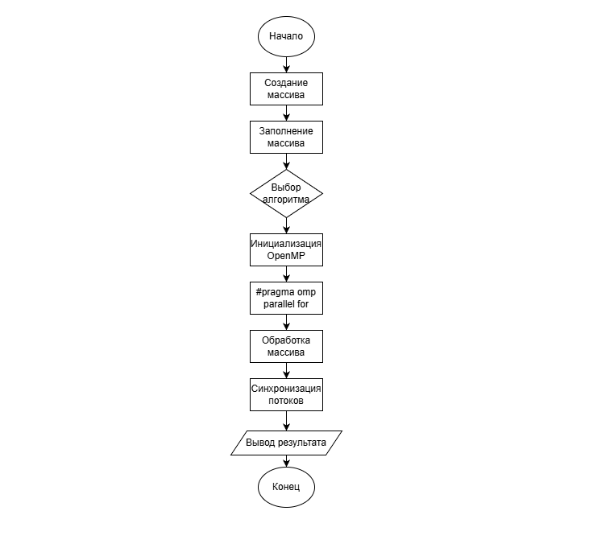

# Практическая работа №2
## Параллельная реализация простых алгоритмов сортировки с использованием OpenMP

### Задание
1. Последовательная реализация
Реализованы алгоритмы сортировки пузырьком, выбором и вставками, выполненные в последовательном режиме без применения технологии OpenMP.

2. Параллельная реализация (с OpenMP)
Разработаны параллельные варианты алгоритмов сортировки с применением директив OpenMP. Основная параллелизация осуществлялась по внешним циклам алгоритмов.
Анализ производительности выполнялся на массивах следующих размеров:
- 1 000 элементов;
- 10 000 элементов;
- 100 000 элементов.
