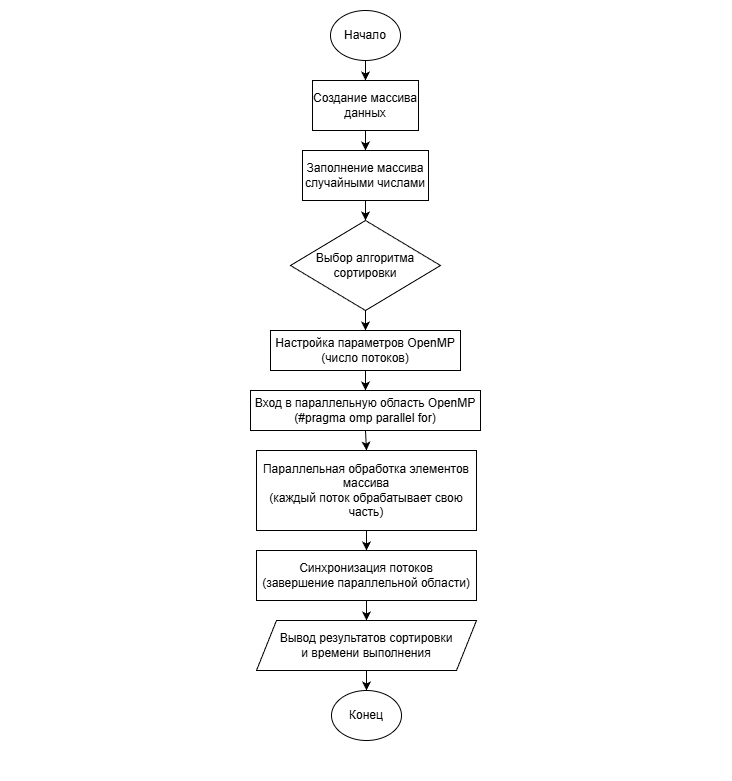

# Практическая работа №2
## Параллельная реализация простых алгоритмов сортировки с использованием OpenMP

### Задание
1. Последовательная реализация
Реализованы алгоритмы сортировки пузырьком, выбором и вставками, выполненные в последовательном режиме без применения технологии OpenMP.


2. Параллельная реализация (с OpenMP)
Разработаны параллельные варианты алгоритмов сортировки с применением директив OpenMP. Основная параллелизация осуществлялась по внешним циклам алгоритмов.
Анализ производительности выполнялся на массивах следующих размеров:
- 1 000 элементов;
- 10 000 элементов;
- 100 000 элементов.



3. Сравнение производительности

Для измерения времени выполнения последовательных и параллельных реализаций использовалась библиотека <chrono>.
На основании полученных результатов выполнено сравнение производительности алгоритмов и сформулированы соответствующие выводы:

### Результаты

```
Array's size: 1000
Bubble Sort (seq): 20 ms
Bubble Sort (OMP): 115 ms
Selection Sort (seq): 10 ms
Selection Sort (OMP): 97 ms
Insertion Sort (seq): 7 ms
Insertion Sort (OMP): 7 ms

Array's size: 10000
Bubble Sort (seq): 1345 ms
Bubble Sort (OMP): 853 ms
Selection Sort (seq): 770 ms
Selection Sort (OMP): 1056 ms
Insertion Sort (seq): 549 ms
Insertion Sort (OMP): 517 ms

Array's size: 100000
Bubble Sort (seq): 83099 ms
Bubble Sort (OMP): 14876 ms
Selection Sort (seq): 45635 ms
Selection Sort (OMP): 8149 ms
Insertion Sort (seq): 31205 ms
Insertion Sort (OMP): 31538 ms
```

### Компиляция в MINGW64 (пример)

```
$ g++ -fopenmp practice2_main.cpp -o practice2_main
$ ./practice2_main.exe
```

### Контрольные вопросы

**1. В чём основные отличия сортировок пузырьком, выбором и вставкой?**

Сортировка пузырьком основана на многократном сравнении и обмене соседних элементов, в результате чего наибольшие элементы постепенно перемещаются в конец массива.
Сортировка выбором на каждом шаге находит минимальный элемент в неотсортированной части массива и помещает его на соответствующую позицию.
Сортировка вставками формирует отсортированную часть массива, последовательно вставляя в неё новые элементы на правильные позиции.

**2. Почему параллельная сортировка вставками сложнее при использовании OpenMP?**

Сортировка вставками имеет выраженные зависимости между шагами алгоритма: каждый следующий элемент вставляется с учётом результатов предыдущих операций. Из-за этого элементы массива нельзя обрабатывать независимо в разных потоках, что существенно ограничивает возможности эффективной параллелизации с использованием OpenMP.

**3. Какие директивы OpenMP были использованы?**

В процессе реализации использовалась директива

```
#pragma omp parallel for
```

которая позволяет распараллеливать выполнение циклов и распределять итерации между несколькими потоками. Данная директива применялась преимущественно для внешних циклов алгоритмов сортировки.

**4. Какие преимущества и недостатки имеет параллельная сортировка на CPU?**

К преимуществам параллельной сортировки относится возможность ускорения выполнения программы за счёт использования нескольких потоков процессора.
К недостаткам можно отнести накладные расходы на создание и синхронизацию потоков, а также ограниченную эффективность для простых алгоритмов сортировки и небольших объёмов данных.

**5. Как можно измерить производительность программы на C++?**

Производительность программы можно измерить с помощью библиотеки <chrono>, фиксируя время начала и окончания выполнения определённого участка кода и вычисляя разницу между этими значениями.

**6. Как изменяется производительность при увеличении числа потоков?**

При увеличении числа потоков производительность сначала может возрастать за счёт параллельного выполнения вычислений. Однако при дальнейшем увеличении количества потоков прирост производительности уменьшается или может возникнуть замедление из-за накладных расходов на управление потоками и синхронизацию.

**7. В каких случаях параллельная сортировка может оказаться хуже последовательной?**

Параллельная сортировка может быть менее эффективной при работе с небольшими массивами данных, при наличии сильных зависимостей между этапами алгоритма, а также при высоких затратах на синхронизацию потоков и управление параллельным выполнением.
